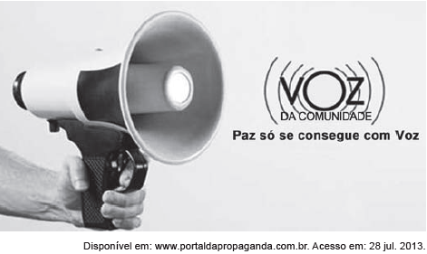

Essa propaganda defende a transformação social e a diminuição da violência por meio da palavra. Isso se evidencia pela

- [ ] predominância de tons claros na composição da peça publicitária.
- [x] associação entre uma arma de fogo e um megafone.
- [ ] grafia com inicial maiúscula da palavra “voz” no slogan.
- [ ] imagem de uma mão segurando um megafone.
- [ ] representação gráfica da propagação do som.

A peça publicitária da “Voz da comunidade” é constituída por textos verbais e não verbais, num sincretismo em que imagens correspondem ao sentido das palavras do enunciado e vice-versa. Assim, o megafone figurativiza o tema da palavra, do discurso, da voz da comunidade, da comunicação social; a arma de fogo, convertida em megafone, representa o tema da violência e, ao mesmo tempo, da transformação social conquistada por meio da palavra.
