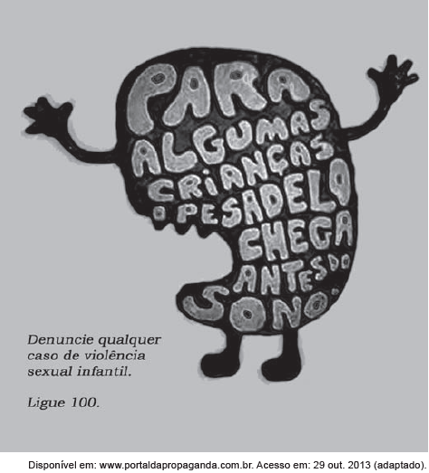

Os meios de comunicação podem contribuir para a resolução de problemas sociais, entre os quais o da violência sexual infantil. Nesse sentido, a propaganda usa a metáfora do pesadelo para

- [ ] informar crianças vítimas de abuso sexual sobre os perigos dessa prática, contribuindo para erradicá-la.
- [ ] denunciar ocorrências de abuso sexual contra meninas, com o objetivo de colocar criminosos na cadeia.
- [x] dar a devida dimensão do que é o abuso sexual para uma criança, enfatizando a importância da denúncia.
- [ ] destacar que a violência sexual infantil predomina durante a noite, o que requer maior cuidado dos responsáveis nesse período.
- [ ] chamar a atenção para o fato de o abuso infantil ocorrer durante o sono, sendo confundido por algumas crianças com um pesadelo.

A propaganda, ao dizer que, para algumas crianças, o pesadelo (sempre temido por elas) vem antes do sono, estimula que se denunciem práticas de violência sexual infantil, aproveitando-se de uma referência do próprio universo infantil.
