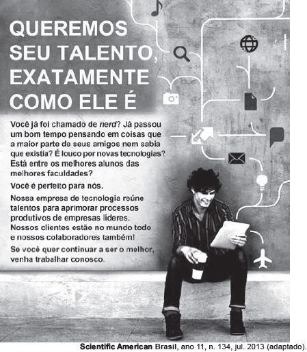

Para atingir o objetivo de recrutar talentos, esse texto publicitário

- [ ] afirma, com a frase “Queremos seu talento exatamente como ele é“, que qualquer pessoa com talento pode fazer parte da equipe.
- [x] apresenta como estratégia a formação de um perfil por meio de perguntas direcionadas, o que dinamiza a interação texto-leitor.
- [ ] utiliza a descrição da empresa como argumento principal, pois atinge diretamente os interessados em informática.
- [ ] usa estereótipo negativo de uma figura conhecida, o nerd, pessoa introspectiva e que gosta de informática.
- [ ] recorre a imagens tecnológicas ligadas em rede, para simbolizar como a tecnologia é interligada.

O anúncio publicitário, por meio de perguntas direcionadas, procura chegar a seu público-alvo: jovens inteligentes, cursando as melhores universidades, com grande interesse por tecnologia. Por meio dessa estratégia de especificar o perfil de pessoas a quem se destina o anúncio, o texto consegue dinamizar a interação com seus leitores.
