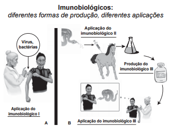

Embora sejam produzidos e utilizados em situações distintas, os imunobiológicos l e II atuam de forma semelhante nos humanos e equinos, pois

- [ ] conferem imunidade passiva.
- [ ] transferem células de defesa.
- [ ] suprimem a resposta imunológica.
- [x] estimulam a produção de anticorpos.
- [ ] desencadeiam a produção de antígenos.

Os dois procedimentos mostrados correspondem à introdução de antígenos para estimular a produção de anticorpos específcos nos organismos inoculados.
