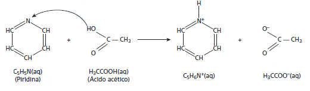

Grande quantidade dos maus odores do nosso dia a dia está relacionada a compostos alcalinos. Assim, em vários desses casos, pode-se utilizar o vinagre, que contém entre 3,5% e 5% de ácido acético, para diminuir ou eliminar o mau cheiro. Por exemplo, lavar as mãos com vinagre e depois enxaguá-las com água elimina o odor de peixe, já que a molécula de piridina **($\ce{C5H5N}$)** é uma das substâncias responsáveis pelo odor característico de peixe podre.

SILVA, V. A.; BENITE, A. M. C.; SOARES, M. H. F. B. Algo aqui não cheira bem… A química do mau cheiro. Química Nova na Escola, v. 33, n. 1, fev. 2011 (adaptado).

A eficiência do uso do vinagre nesse caso se explica pela

- [ ] sobreposição de odor, propiciada pelo cheiro característico do vinagre.
- [ ] solubilidade da piridina, de caráter ácido, na solução ácida empregada.
- [ ] inibição da proliferação das bactérias presentes, devido à ação do ácido acético.
- [ ] degradação enzimática da molécula de piridina, acelerada pela presença de ácido acético.
- [x] reação de neutralização entre o ácido acético e a piridina, que resulta em compostos sem mau odor.

A piridina, por apresentar caráter básico (alcalino), pode ser neutralizada pelo ácido acético, presente no vinagre, conforme a equação:

Nesse processo, há formação de íons, que permanecem em solução aquosa, desse modo minimiza-se, assim, a liberação de gases responsáveis pelo odor dos peixes.
