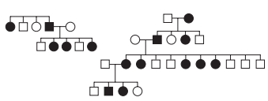

No heredograma, os símbolos preenchidos representam pessoas portadoras de um tipo raro de doença genética. Os homens são representados pelos quadrados e as mulheres, pelos círculos.

Qual é o padrão de herança observado para essa doença?

- [ ] Dominante autossômico, pois a doença aparece em ambos os sexos.
- [ ] Recessivo ligado ao sexo, pois não ocorre a transmissão do pai para os filhos.
- [ ] Recessivo ligado ao Y, pois a doença é transmitida dos pais heterozigotos para os flhos.
- [x] Dominante ligado ao sexo, pois todas as filhas de homens afetados também apresentam a doença.
- [ ] Codominante autossômico, pois a doença é herdada pelos flhos de ambos os sexos, tanto do pai quanto da mãe

A análise do heredograma confirma que todas as filhas de homens afetados também são afetadas, caracterizando um padrão de herança dominante ligado ao sexo.

        