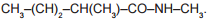
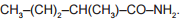
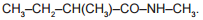
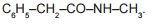
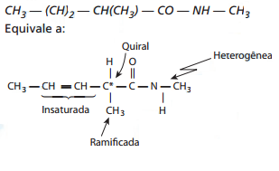

O estudo de compostos orgânicos permite aos analistas definir propriedades físicas e químicas responsáveis pelas características de cada substância descoberta. Um laboratório investiga moléculas quirais cuja cadeia carbônica seja insaturada, heterogênea e ramificada.

A fórmula que se enquadra nas características da molécula investigada é

- [ ] 
- [x] 
- [ ] 
- [ ] 
- [ ] 

