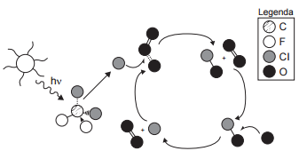

A liberação dos gases clorofluorcarbonos (CFCs) na atmosfera pode provocar depleção de ozônio ($\ce{O3}$) na estratosfera. O ozônio estratosférico é responsável por absorver parte da radiação ultravioleta emitida pelo Sol, a qual é nociva aos seres vivos. Esse processo, na camada de ozônio, é ilustrado simplificadamente na figura.

Quimicamente, a destruição do ozônio na atmosfera por gases CFCs é decorrência da

 

 

 

 

- [ ] clivagem da molécula de ozônio pelos CFCs para produzir espécies radicalares.
- [x] produção de oxigênio molecular a partir de ozônio, catalisada por átomos de cloro.
- [ ] oxidação do monóxido de cloro por átomos de oxigênio para produzir átomos de cloro.
- [ ] reação direta entre os CFCs e o ozônio para produzir oxigênio molecular e monóxido de cloro.
- [ ] reação de substituição de um dos átomos de oxigênio na molécula de ozônio por átomos de cloro.

A radiação ultravioleta provoca a clivagem da molécula de CFC, produzindo átomos de cloro que aceleram a conversão do ozônio em gás oxigênio, de acordo com as reações:

$\ce{O3 -> O2 + O}$\
$\ce{O3 + Cl -> O2 + ClO}$\
$\ce{ClO + O -> Cl + O2}$\
\__\__\__\__\__\__\__\__\__\__\__\_\
$\ce{2O3 ->\[\text{Cl}] 3O2}$
