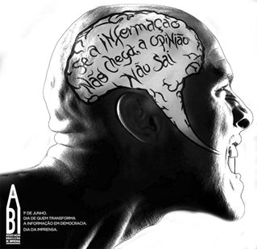

**Zero Hora**, jun. 2008 (adaptado).

 

Dia do Músico, do Professor, da Secretária, do Veterinário... Muitas são as datas comemoradas ao longo do ano e elas, ao darem visibilidade a segmentos específicos da sociedade, oportunizam uma reflexão sobre a responsabilidade social desses segmentos. Nesse contexto, está inserida a propaganda da Associação Brasileira de Imprensa (ABI), em que se combinam elementos verbais e não verbais para se abordar a estreita relação entre imprensa, cidadania, informação e opinião. Sobre essa relação, depreende-se do texto da ABI que,

- [ ] para a imprensa exercer seu papel social, ela deve transformar opinião em informação.
- [ ] para a imprensa democratizar a opinião, ela deve selecionar a informação.
- [ ] para o cidadão expressar sua opinião, ele deve democratizar a informação.
- [ ] para a imprensa gerar informação, ela deve fundamentar-se em opinião.
- [x] para o cidadão formar sua opinião, ele deve ter acesso à informação.

A imagem mostra o perfil de um cidadão gritando uma frase que sintetiza o que se afirma na alternativa e: a necessidade de informação para se consolidar uma opinião.

        