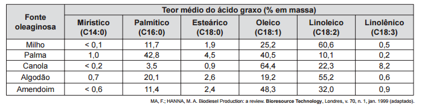

# q
O biodiesel não é classificado como uma substância pura, mas como uma mistura de ésteres derivados dos ácidos graxos presentes em sua matéria-prima. As propriedades do biodiesel variam com a composição do óleo vegetal ou gordura animal que lhe deu origem, por exemplo, o teor de ésteres saturados é responsável pela maior estabilidade do biodiesel frente à oxidação, o que resulta em aumento da vida útil do biocombustível. O quadro ilustra o teor médio de ácidos graxos de algumas fontes oleaginosas.

Qual das fontes oleaginosas apresentadas produziria um biodiesel de maior resistência à oxidação?

# a
Milho.

# b
Palma.

# c
Canola.

# d
Algodão.

# e
Amendoim

# r
b

# s
De acordo com a tabela, os ácidos Mirístico, Palmítico e Esteárico são saturados, enquanto os ácidos Oleico, Linoleico e Linolênico são insaturados.

A partir do enunciado, conclui-se que a fonte oleaginosa que produziria um biodiesel de maior resistência à oxidação é a palma, pois apresenta um maior teor de ácidos graxos saturados, que irão formar ésteres saturados.
