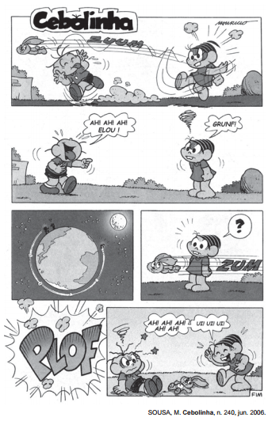
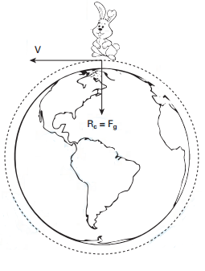

Um professor utiliza essa história em quadrinhos para discutir com os estudantes o movimento de satélites. Nesse sentido, pede a eles que analisem o movimento do coelhinho, considerando o módulo da velocidade constante.

Desprezando a existência de forças dissipativas, o vetor aceleração tangencial do coelhinho, no terceiro quadrinho, é

- [x] nulo.
- [ ] paralelo à sua velocidade linear e no mesmo sentido.
- [ ] paralelo à sua velocidade linear e no sentido oposto.
- [ ] perpendicular à sua velocidade linear e dirigido para o centro da Terra.
- [ ] perpendicular à sua velocidade linear e dirigido para fora da superfície da Terra

De acordo com enunciado, o módulo da velocidade é constante e são desprezíveis as forças dissipativas, logo, a resultante no “coelhinho” coincide com a força gravitacional, como mostra a figura abaixo.

Dessa forma, o “coelhinho” efetua um movimento circular e uniforme, e o vetor aceleração tangencial é nulo.
