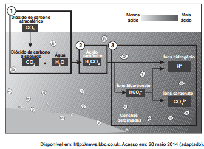

Parte do gás carbônico da atmosfera é absorvida pela água do mar. O esquema representa reações que ocorrem naturalmente, em equilíbrio, no sistema ambiental marinho. O excesso de dióxido de carbono na atmosfera pode afetar os recifes de corais.

O resultado desse processo nos corais é o(a)

- [ ] seu branqueamento, levando à sua morte e extinção.
- [ ] excesso de fixação de cálcio, provocando calcificação indesejável.
- [ ] menor incorporação de carbono, afetando seu metabolismo energético.
- [ ] estímulo da atividade enzimática, evitando a descalcificação dos esqueletos.
- [x] dano à estrutura dos esqueletos calcários, diminuindo o tamanho das populações.

A acidificação da água oceânica conduz ao aumento da dissolução do calcário presente na estrutura dos recifes de coral.

        