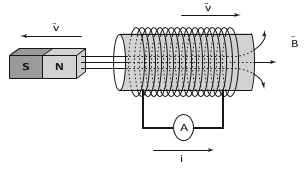

O funcionamento dos geradores de usinas elétricas baseia-se no fenômeno da indução eletromagnética, descoberto por Michael Faraday no século XIX. Pode-se observar esse fenômeno ao se movimentar um imã e uma espira em sentidos opostos com módulo da velocidade igual a v, induzindo uma corrente elétrica de intensidade i, como ilustrado na figura.

 

A fim de se obter uma corrente com o mesmo sentido da apresentada na figura, utilizando os mesmos materiais, outra possibilidade é mover a espira para a

- [x] esquerda e o imã para a direita com polaridade invertida.
- [ ] direita e o imã para a esquerda com polaridade invertida.
- [ ] esquerda e o imã para a esquerda com mesma polaridade.
- [ ] direita e manter o imã em repouso com polaridade invertida.
- [ ] esquerda e manter o imã em repouso com mesma polaridade.

Na situacão representada, o imã e a espira se afastam. Assim, o fluxo eletromagnético na espira diminui e, consequentemente, o campo induzido $(\overrightarrow{B}\_{ind})$ está no mesmo sentido do campo magnético original $(\overrightarrow{B})$ devido ao imã.

Para que a corrente induzida $(I\_{ind})$ na espira não mude de sentido, o campo magnético induzido $(B\_{ind})$ deve manter sua orientação espacial. Para que isso ocorra, há duas possibilidades:

I)      O campo magnético original $(\overrightarrow{B})$ deve continuar para direita e o fluxo eletromagnético continuar a diminuir.

II)      O campo magnético original $(\overrightarrow{B})$ deve apresentar sentido para a esquerda e o fluxo eletromagnético aumentar.

Das alternativas apresentadas, a única que é coerente com as posssibilidades I ou II apresentadas é a "A"; pois, ao inverter a polaridade do imã, o campo magnético original fica para a esquerda e, ao movimentar a espira para a esquerda e o imã para direita, verifica-se o aumento do fluxo eletromagnético.
