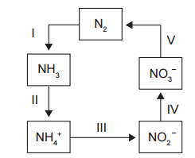
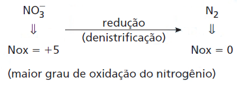

A aplicação excessiva de fertilizantes nitrogenados na agricultura pode acarretar alterações no solo e na água pelo acúmulo de compostos nitrogenados, principalmente a forma mais oxidada, favorecendo a proliferação de algas e plantas aquáticas e alterando o ciclo do nitrogênio, representado no esquema. A espécie nitrogenada mais oxidada tem sua quantidade controlada por ação de microrganismos que promovem a reação de redução dessa espécie, no processo denominado desnitrificação.

O processo citado está representado na etapa

- [ ] I.
- [ ] II.
- [ ] III.
- [ ] IV.
- [x] V.

        