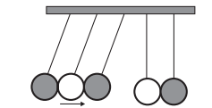
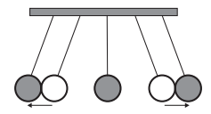
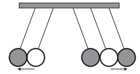
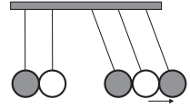
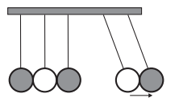
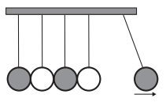
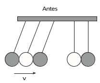

O pêndulo de Newton pode ser constituído por cinco pêndulos idênticos suspensos em um mesmo suporte. Em um dado instante, as esferas de três pêndulos são deslocadas para a esquerda e liberadas, deslocando-se para a direita e colidindo elasticamente com as outras duas esferas, que inicialmente estavam paradas.

 

 

- [ ] 
- [ ] 
- [x] 
- [ ] 
- [ ] 

No pêndulo de Newton, as esferas possue, massas iguais. Admitindo que em todas as figuras as setas indiquem em escala as intensidades das velocidades das esferas, pode-se calcular a quantidade de movimento do sistema imediatamente antes da colisão.

$\overrightarrow{Q}\_{antes}^{sist} = $ 3mv horizontal, para a direita

como o sistema é mecanicamente isolado, temos :

$\overrightarrow{Q}\_{antes}^{sist} = \overrightarrow{Q}\_{depois}^{sist}$

Logo, $\overrightarrow{Q}\_{depois}^{sist}$ = 3 mv horizontal, para a direita.

Dessa forma, a única opção que satisfaz essa condição é a letra **"c"**.

 

 
