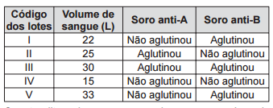

Em um hospital havia cinco lotes de bolsas de sangue, rotulados com os códigos l, II, III, IV e V. Cada lote continha apenas um tipo sanguíneo não identifcado. Uma funcionária do hospital resolveu fazer a identifcação utilizando dois tipos de soro, anti-A e anti-B. Os resultados obtidos estão descritos no quadro.

Quantos litros de sangue eram do grupo sanguíneo do tipo A?

- [ ] 15
- [x] 25
- [ ] 30
- [ ] 33
- [ ] 55

O sangue do tipo A é aquele que aglutina apenas na presença do soro anti-A. Isso equivale, na tabela, ao lote II e, portanto, a 25 litros de sangue.
