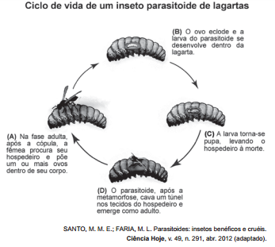

Os parasitoides (misto de parasitas e predadores) são insetos diminutos que têm hábitos muito peculiares: suas larvas podem se desenvolver dentro do corpo de outros organismos, como mostra a figura. A forma adulta se alimenta de pólen e açúcares. Em geral, cada parasitoide ataca hospedeiros de determinada espécie e, por isso, esses organismos vêm sendo amplamente usados para o controle biológico de pragas agrícolas.

A forma larval do parasitoide assume qual papel nessa cadeia alimentar?

- [ ] Consumidor primário, pois ataca diretamente uma espécie herbívora
- [x] Consumidor secundário, pois se alimenta diretamente dos tecidos da lagarta
- [ ] Organismo heterótrofo de primeira ordem, pois se alimenta de pólen na fase adulta
- [ ] Organismo heterótrofo de segunda ordem, pois apresenta o maior nível energético na cadeia
- [ ] Decompositor, pois se alimenta de tecidos do interior do corpo da lagarta e a leva à morte.

Como a lagarta é uma praga agrícola e, portanto, consumidora primária, a forma larval do parasitoide atua como consumidora secundária.
