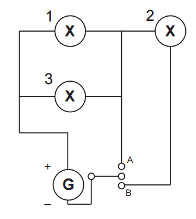

Um sistema de iluminação foi construído com um circuito de três lâmpadas iguais conectadas a um gerador (G) de tensão constante. Esse gerador possui uma chave que pode ser ligada nas posições A ou B.

Considerando o funcionamento do circuito dado, a lâmpada 1 brilhará mais quando a chave estiver na posição

- [ ] B, pois a corrente será maior nesse caso.
- [ ] B, pois a potência total será maior nesse caso.
- [x] A, pois a resistência equivalente será menor nesse caso.
- [ ] B, pois o gerador fornecerá uma maior tensão nesse caso.
- [ ] A, pois a potência dissipada pelo gerador será menor nesse caso.

$i\_{A} = \cfrac{\epsilon}{\cfrac{R}{2}}$                              $i\_{A} = \cfrac{2\epsilon}{R}$

 

$i_B = \cfrac{\epsilon}{\cfrac{3R}{2}}$                              $i_B = \cfrac{2\epsilon}{3R}$

Comparando-se as intensidades das correntes nas duas situações, conclui-se que ela diminui quando a chave está na posição B; uma vez que a resistência equivalente do circuito aumentou nessa posição.

Dessa forma, na posição B, todas as lâmpadas brilharão menos se comparadas às da situação da posição A.
