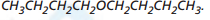
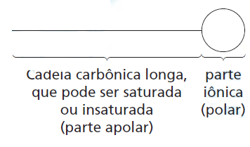

A capacidade de limpeza e a eficiência de um sabão dependem de sua propriedade de formar micelas estáveis, que arrastam com facilidade as moléculas impregnadas no material a ser limpo. Tais micelas têm em sua estrutura partes capazes de interagir com substâncias polares, como a água, e partes que podem interagir com substâncias apoliares, como as gorduras e os óleos.

SANTOS, W. L. P; MÕL, G. S. (Coords.). Química e sociedade. São Paulo: Nova Geração, 2005 (adaptado).

A substância capaz de formar as estruturas mencionadas é

- [ ] 
- [x] 
- [ ] 
- [ ] 
- [ ] 

As substâncias capazes de formar micelas devem apresentar em sua estrutura as seguintes características:

Das alternativas, a estrutura que apresenta as características mostradas anteriormente é a

$\ce{C17H33}$     $\ce{COONa}$\
parte apolar       parte polar
