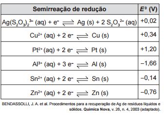

A revelação das chapas de raios X gera uma solução que contém íons prata na forma de **$\ce{Ag(S2O3)2^3-}$**. Para evitar a descarga desse metal no ambiente, a recuperação de prata metálica pode ser feita tratando eletroquimicamente essa solução com uma espécie adequada. O quadro apresenta semirreações de redução de alguns íons metálicos.

Das espécies apresentadas, a adequada para essa recuperação é

- [ ] $Cu (s)$
- [ ] $Pt(s)$
- [ ] $\ce{Al^3+} (aq)$
- [x] $Sn (s)$
- [ ] $\ce{Zn^2+} (aq)$

Para que haja a recuperação de prata metálica, isto é, a redução dos íons $Ag^+ Ag^0$, conforme a semirreação :

$\ce{Ag(S2O3)2^3- (aq) + e^- <=>> Ag(s) + 2S2O3^2- (aq)}$

$E^0 = +0,02 \\, v$

é preciso escolher um metal, que sofrerá oxidação, cujo cátion tenha potencial de redução menor que $+0,02 \\, v$.

Entre as alternativas fornecidas, somente o estanho metálico, $Sn (s)$, atenderá essas condições.
