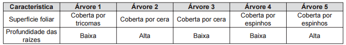

Uma região de Cerrado possui lençol freático profundo, estação seca bem marcada, grande insolação e recorrência de incêndios naturais. Cinco espécies de árvores nativas, com as características apresentadas no quadro, foram avaliadas quanto ao seu potencial para uso em projetos de reflorestamento nessa região.

Qual é a árvore adequada para o reforestamento dessa região?

 

- [ ] 1
- [x] 2
- [ ] 3
- [ ] 4
- [ ] 5

Uma vez que o lençol freático da área a ser reforestada (Cerrado) é profundo, além da grande insolação típica da região, as árvores escolhidas devem ser dotadas, respectivamente, de raízes profundas e de folhas ricas em cera.
