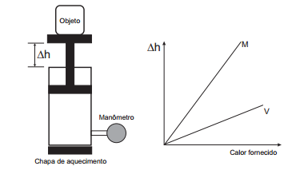
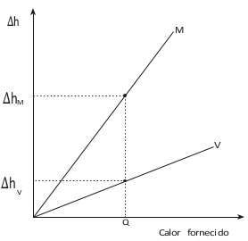

Um sistema de pistão contendo um gás é mostrado na figura. Sobre a extremidade superior do êmbolo, que pode movimentar-se livremente sem atrito, encontra-se um objeto. Através de uma chapa de aquecimento é possível fornecer calor ao gás e, com auxílio de um manômetro, medir sua pressão. A partir de diferentes valores de calor fornecido, considerando o sistema como hermético, o objeto elevou-se em valores Δh, como mostrado no gráfico. Foram estudadas, separadamente, quantidades equimolares de dois diferentes gases, denominados M e V.

A diferença no comportamento dos gases no experimento decorre do fato de o gás M, em relação ao V, apresentar

- [ ] maior pressão de vapor.
- [ ] menor massa molecular.
- [ ] maior compressibilidade.
- [ ] menor energia de ativação.
- [x] menor capacidade calorífica.

Vamos considerar que os gases apresentem comportamento ideal e a transformação a que eles foram submetidos seja isobárica. Nestas condições, temos:

$p \cdot \Delta V = n \cdot R \cdot\Delta T $

$\Delta V = \cfrac{n \cdot R \cdot \Delta T}{p}$

como $\cfrac{n \cdot R}{P}$ é o mesmo para os dois gases, temos :

$\cfrac{\Delta V_M}{\Delta T_M} = \cfrac{\Delta V_V}{\Delta T_V}$

A partir do gráfico, podemos concluir que, para uma mesma quantidade de calor fornecida, o gás M apresenta uma variação volumétrica maior ($\Delta V_M > \Delta V_V$).

Dessa forma, a partir da equação acima, $\Delta T_M > \Delta T_V$.

Mas, uma vez que a quantidade de calor fornecida aos gases é a mesma, temos :

$C_M \cdot \Delta T_M = C_V \cdot \Delta T_V$

$Q_M$     =     $Q_V$

Essa igualdade só é válida se $C_M < C_V$.

Portanto a capacidade térmica do gás M é menor que a capacidade térmica do gás V.

 

 
