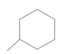
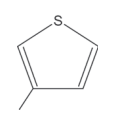
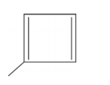
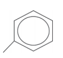
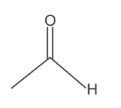
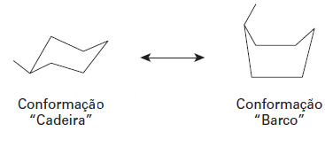

# q
A forma das moléculas, como representadas no papel, nem sempre é planar. Em um determinado fármaco, a molécula contendo um grupo não planar é biologicamente ativa, enquanto moléculas contendo substituintes planares são inativas.

O grupo responsável pela bioatividade desse fármaco é

# a

# b

# c

# d

# e

# r
a

# s
No metilciclo-hexano, todos os átomos de carbono encontram-se no centro de um tetraedro, pois fazem 4 ligações simples (4 nuvens eletrônicas). Dessa forma, o composto apresenta geometria tridimensional, sendo suas conformações espaciais mais comuns representadas:

