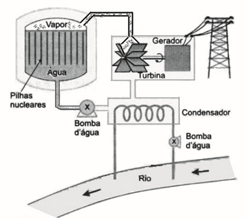

# q
A elevação da temperatura das águas de rios, lagos e mares diminui a solubilidade do oxigênio, pondo em risco as diversas formas de vida aquática que dependem desse gás. Se essa elevação de temperatura acontece por meios artificiais, dizemos que existe poluição térmica. As usinas nucleares, pela própria natureza do processo de geração de energia, podem causar esse tipo de poluição.

Que parte do ciclo de geração de energia das usinas nucleares está associada a esse tipo de poluição?

# a
Fissão do material radioativo.

# b
Condensação do vapor-d‘água no final do processo.

# c
Conversão de energia das turbinas pelos geradores.

# d
Aquecimento da água líquida para gerar vapor-d‘água

# e
Lançamento do vapor-d‘água sobre as pás das turbinas.

# r
b

# s
Do esquema simplificado de usina termonuclear, pode-se afirmar que:

.   E energia liberada na reação de fissão nuclear é aproveitada para ferver a água que, como vapor em alta pressão, aciona a turbina.

.   A turbina adquire energia cinética de rotação necessária na geração de energia elétrica.

.   No final do processo, o vapor é condensado e a água do circuito fechado é bombeada de volta para o reator.

A chamada poluição térmica se deve ao aquecimento da água do rio utilizada nas trocas de calor no condensador.
