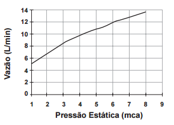

# q
Uma pessoa, lendo o manual de uma ducha que acabou de adquirir para a sua casa, observa o gráfico, que relaciona a vazão na ducha com a pressão, medida em metros de coluna de água (mca).

Nessa casa residem quatro pessoas. Cada uma delas toma um banho por dia, com duração média de 8 minutos, permanecendo o registro aberto com vazão máxima durante esse tempo. A ducha é instalada em um ponto seis metros abaixo do nível da lâmina de água, que se mantém constante dentro do reservatório.

Ao final de 30 dias, esses banhos consumirão um volume de água, em litros, igual a

# a
69120

# b
17280

# c
11520

# d
8640

# e
2880

# r
c

# s
Com a ducha instalada a 6 m abaixo da lâmina da água, a pressão de saída da água é de 6 mca. A partir do gráfico, pode-se obter, para essa pressão, a vazão de 12 L/min.

Dessa forma, o volume total de água utilizada por 4 pessoas, em 30 dias, com banhos diários de 8 min de duração, pode ser calculado da seguinte maneira:

$V = 12 \cfrac{L}{min} \times \cfrac{8\\,min}{banho} \times \cfrac{4\\,banhos}{dias} \times 30\\, dias = 11520\\,L$

 
