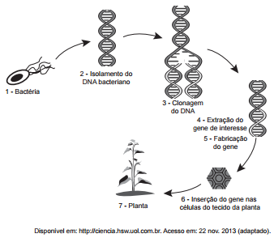

Em um laboratório de genética experimental, observou-se que determinada bactéria continha um gene que conferia resistência a pragas específcas de plantas. Em vista disso, os pesquisadores procederam de acordo com a figura.

Do ponto de vista biotecnológico, como a planta representada na figura é classifcada?

- [ ] Clone.
- [ ] Híbrida.
- [ ] Mutante.
- [ ] Adaptada.
- [x] Transgênica.

O esquema mostra que a planta incorporou um gene recebido de outra espécie, caracterizando-a como transgênica

        