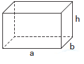
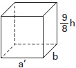

Um carpinteiro fabrica portas retangulares maciças, feitas de um mesmo material. Por ter recebido de seus clientes pedidos de portas mais altas, aumentou sua altura em $\cfrac{1}{8}$, preservando suas espessuras. A fim de manter o custo com o material de cada porta, precisou reduzir a largura.

A razão entre a largura da nova porta e a largura da porta anterior é

- [ ] $\cfrac{1}{8}$
- [ ] $\cfrac{7}{8}$
- [ ] $\cfrac{8}{7}$
- [x] $\cfrac{8}{9}$
- [ ] $\cfrac{9}{8}$

Para manter o mesmo custo, as novas portas devem ter o mesmo volume das portas do primeiro modelo.

\
**Primeiro modelo**

 

\
**Segundo modelo**

 

$abh = a'b\cdot\cfrac{9}{8}h$

$a =\cfrac{9}{8}a'$

$\cfrac{a'}{a} =\cfrac{8}{9}$
