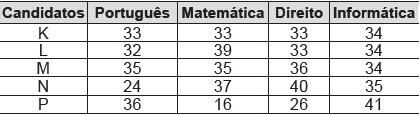

Os candidatos K, L, M, N e P estão disputando uma única vaga de emprego em uma empresa e fizeram provas de português, matemática, direito e informática. A tabela apresenta as notas obtidas pelos cinco candidatos.

Segundo o edital de seleção, o candidato aprovado será aquele para o qual a mediana das notas obtidas por ele nas quatro disciplinas for a maior.

O candidato aprovado será

- [ ] K.
- [ ] L.
- [ ] M.
- [x] N.
- [ ] P.

Coloquem-se as notas de cada candidato em um rol.

K: (33, 33, 33, 34) ∴ $mediana_K = \cfrac{33+33}{2} = 33$

L: (32, 33, 34, 39) ∴ $mediana_L = \cfrac{33+34}{2} = 33,5$

M: (34, 35, 35, 36) ∴ $mediana_M = \cfrac{35+35}{2} = 35$

N: (24, 35, 37, 40) ∴ $mediana_N = \cfrac{35+37}{2} = 36$

P: (16, 26, 36, 41) ∴ $mediana_P = \cfrac{26+36}{2} = 31$

Maior mediana é a do candidato N.

        