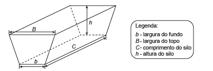

# q
     Na alimentação de gado de corte, o processo de cortar a forragem, colocá-la no solo, compactá-la e protegê-la com uma vedação denomina-se silagem. Os silos mais comuns são os horizontais, cuja forma é a de um prisma reto trapezoidal, conforme mostrado na figura.

Considere um silo de 2 m de altura, 6 m de largura de topo e 20 m de comprimento. Para cada metro de altura do silo, a largura do topo tem 0,5 m a mais do que a largura do fundo. Após a silagem, 1 tonelada de forragem ocupa 2 $m^3$desse tipo de silo.

Após a silagem, a quantidade máxima de forragem que cabe no silo, em toneladas, é

EMBRAPA. **Gado de corte.**\
Disponível em: www.cnpgc.embrapa.br. Acesso em: 1 ago. 2012 (adaptado).

# a
110\.

# b
125\.

# c
130\.

# d
220\.

# e
260\.

# r
a

# s
De h = 2, B = 6 e B = b + h . 0,5, tem-se:

6 = b + 2 . 0,5, ou seja:

b = 5.

 

A área, em $m^2$, do trapézio é dada por:

$S = \cfrac{(B+b)\cdot h}{2} = \cfrac{(6+5) \cdot 2}{2} = 11$

A capacidade do silo (volume do prisma), em $m^3$, é dada por:

S . C = 11 . 20 = 220

 

A quantidade máxima, em toneladas, de forragem é dada por $\cfrac{220}{2} = 110$.
