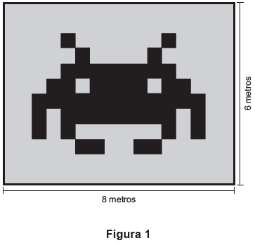
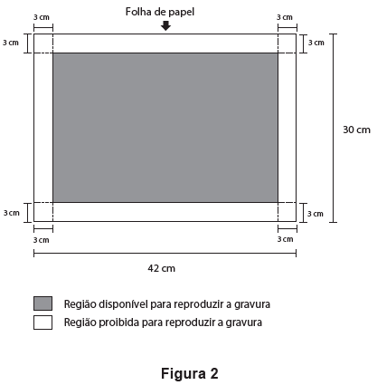
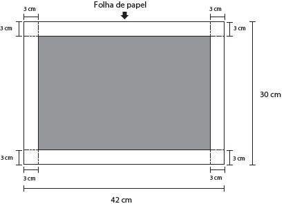

A Figura 1 representa uma gravura retangular com 8 m de comprimento e 6 m de altura.

Deseja-se reproduzi-la numa folha de papel retangular com 42 cm de comprimento e 30 cm de altura, deixando livres 3 cm em cada margem, conforme a Figura 2.

A reprodução da gravura deve ocupar o máximo possível da região disponível, mantendo-se as proporções da Figura 1.

PRADO, A. C. **Superinteressante**, ed. 301, fev. 2012 (adaptado).

A escala da gravura reproduzida na folha de papel é

- [ ] 1 : 3.
- [ ] 1 : 4.
- [ ] 1 : 20.
- [x] 1 : 25.
- [ ] 1 : 32.

Da figura acima, tem-se que a gravura poderá ter, no máximo, 36 cm de comprimento e 24 cm de altura. Se a reprodução tiver 36 cm de comprimento, sendo h sua altura, tem-se:

36 ⎯→ 800\
h   ⎯→ 600

h = 27 cm (**não é possível**)

 

Para 24 cm de altura, sendo c o comprimento, tem-se

24 ⎯→ 600\
c   ⎯→ 800

c = 32 cm

Logo, a maior escala possível é de 24 : 600, ou seja, 1 : 25.
