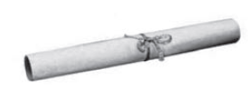

Uma empresa que organiza eventos de formatura confecciona canudos de diplomas a partir de folhas de papel quadradas. Para que todos os canudos fiquem idênticos, cada folha é enrolada em torno de um cilindro de madeira de diâmetro d em centímetros, sem folga, dando-se 5 voltas completas em torno de tal cilindro. Ao final, amarra-se um cordão no meio do diploma, bem ajustado, para que não ocorra o desenrolamento, como ilustrado na figura.

Em seguida, retira-se o cilindro de madeira do meio do papel enrolado, finalizando a confecção do diploma. Considere que a espessura da folha de papel original seja desprezível.

Qual é a medida, em centímetros, do lado da folha de papel usado na confecção do diploma?

- [ ] $\pi d$
- [ ] $2\pi d$
- [ ] $4\pi d$
- [x] $5\pi d$
- [ ] $10\pi d$

A medida do lado da folha de papel deve ser igual a cinco vezes o comprimento da circunferência do canudo que possui raio $r = \cfrac{d}{2}$.

Logo: $l = 5 \cdot 2\pi \cdot r$

$l = 5 \cdot 2 \pi \cdot \cfrac{d}{2}$

$l = 5\pi d$

        