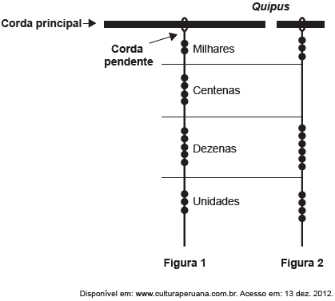

     Os incas desenvolveram uma maneira de registrar quantidades e representar números utilizando um sistema de numeração decimal posicional: um conjunto de cordas com nós denominado quipus. O quipus era feito de uma corda matriz, ou principal (mais grossa que as demais), na qual eram penduradas outras cordas, mais finas, de diferentes tamanhos e cores (cordas pendentes). De acordo com a sua posição, os nós significavam unidades, dezenas, centenas e milhares. Na Figura 1, o quipus representa o número decimal 2453. Para representar o “zero” em qualquer posição, não se coloca nenhum nó.

O número da representação do quipus da Figura 2, em base decimal, é

- [ ] 364\.
- [ ] 463\.
- [x] 3064\.
- [ ] 3640\.
- [ ] 4603\.

De acordo com o exemplo descrito no enunciado, o número da representação do quipus da Figura 2, em base decimal, é 3064.
