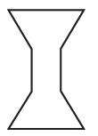
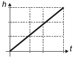
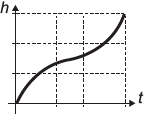
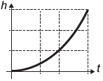
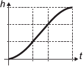
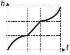

Para comemorar o aniversário de uma cidade, um artista projetou uma escultura transparente e oca, cujo formato foi inspirado em uma ampulheta. Ela é formada por três partes de mesma altura: duas são troncos de cone iguais e a outra é um cilindro. A figura é a vista frontal dessa escultura.

No topo da escultura foi ligada uma torneira que verte água, para dentro dela, com vazão constante. O gráfico que expressa a altura (h) da água na escultura em função do tempo (t) decorrido é

- [ ] 
- [ ] 
- [ ] 
- [x] 
- [ ] 

Como a vazão é constante, tem-se:

. Para o tronco de cone de “baixo”, as áreas das secções transversais são decrescentes. Portanto a altura h aumenta cada vez mais “rapidamente”, em função do tempo.

. Para o cilindro, as áreas das secções transversais são crescentes. Portanto a altura h aumenta com a taxa de variação constante, em função do tempo.

. Para o tronco de cone de "cima", as áreas das secções transversais são crescentes. Portanto a altura h aumenta cada vez mais "lentamente", em função do tempo.

Dos gráficos apresentados, o único com essas características é o da alternativa **D**.

        