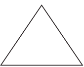
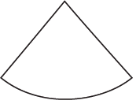
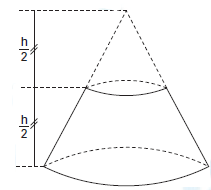

Um sinalizador de trânsito tem o formato de um cone circular reto. O sinalizador precisa ser revestido externamente com adesivo fluorescente, desde sua base (base do cone) até a metade de sua altura, para sinalização noturna. O responsável pela colocação do adesivo precisa fazer o corte do material de maneira que a forma do adesivo corresponda exatamente à parte da superfície lateral a ser revestida.

Qual deverá ser a forma do adesivo?

- [ ] 
- [ ] 
- [ ] 
- [ ] 
- [x] 

Do enunciado, temos a figura:

O adesivo é representado pela planificação da superfície lateral de um tronco de cone, como mostra a figura:

