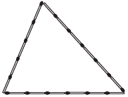

Uma criança deseja criar triângulos utilizando palitos de fósforo de mesmo comprimento. Cada triângulo será construído com exatamente 17 palitos e pelo menos um dos lados do triângulo deve ter o comprimento de exatamente 6 palitos. A figura ilustra um triângulo construído com essas características.

A quantidade máxima de triângulos não congruentes dois a dois que podem ser construídos é

- [x] 3\.
- [ ] 5\.
- [ ] 6\.
- [ ] 8\.
- [ ] 10\.

Sejam x, y e 6 os lados do triângulo, assim:

x + y + 6 = 17

x + y = 11

y = 11 - x **(I)**

Tem-se ainda que:

$x + y \geq 6$ **(II)**\
$x + 6 \geq y$ **(III)        (desigualdade triangular)**\
$y + 6 ​​\geq x$ **(IV)**

Substituindo **(I)** em **(IV)**, tem-se:

$11 - x + 6\geq x$

$17 \geq 2x$  

$x \leq 8,5$

Como o número de palitos é inteiro, tem-se:

$x \leq 8,5$, assim, há apenas as possibilidades:

$x = 8\\, e\\, y = 3$

$x = 7\\, e\\, y = 4$

$x = 6\\, e\\, y = 5$

Portanto, a quantidade pedida é de 3 triângulos.
