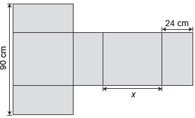
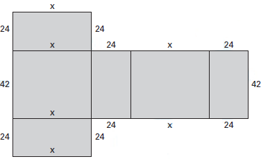
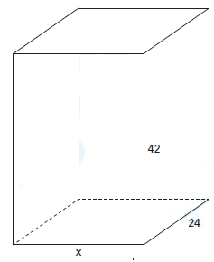

     Conforme regulamento da Agência Nacional de Aviação Civil (Anac), o passageiro que embarcar em voo doméstico poderá transportar bagagem de mão, contudo a soma das dimensões da bagagem (altura + comprimento + largura) não pode ser superior a 115 cm.

     A figura mostra a planificação de uma caixa que tem a forma de um paralelepípedo retângulo.

O maior valor possível para x, em centímetros, para que a caixa permaneça dentro dos padrões permitidos pela Anac é

- [ ] 25\.
- [ ] 33\.
- [ ] 42\.
- [ ] 45\.
- [x] 49\.

Ao completarmos as indicações das dimensões da caixa da figura dada, obtem-se:

Portanto, a caixa montada ficaria assim:

Conforme o regulamento da Anac, tem-se:

$x\_{máx} + 24 + 42 = 115$

$x\_{máx} = 49\\,cm$

        