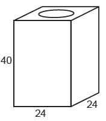

     Uma lata de tinta, com a forma de um paralelepípedo retangular reto, tem as dimensões, em centímetros, mostradas na figura.

     Será produzida uma nova lata, com os mesmos formato e volume, de tal modo que as dimensões de sua base sejam 25% maiores que as da lata atual.

Para obter a altura da nova lata, a altura da lata atual deve ser reduzida em

- [ ] 14,4%
- [ ] 20,0%
- [ ] 32,0%
- [x] 36,0%
- [ ] 64,0%

Volume da lata inicial: $24 \cdot 24 \cdot 40$

Volume da nova lata: $1,25 \cdot 24 \cdot 1,25 \cdot 24 \cdot h$

Como os volumes são iguais:

$24 \cdot 24 \cdot 40 = 1,25 \cdot 24 \cdot 1,25 \cdot 24 \cdot h$

$h = 25,6$

Assim, a altura da nova lata é de 25,6, isto é, $\cfrac{25,6}{40} = 0,64 = 64\\%$ da altura da lata inicial. Assim, deve ser reduzida em 36%.

 

        