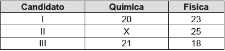

# q
     Ao final de uma competição de ciências em uma escola, restaram apenas três candidatos. De acordo com as regras, o vencedor será o candidato que obtiver a maior média ponderada entre as notas das provas finais nas disciplinas química e física, considerando, respectivamente, os pesos 4 e 6 para elas. As notas são sempre números inteiros. Por questões médicas, o candidato II ainda não fez a prova final de química. No dia em que sua avaliação for aplicada, as notas dos outros dois candidatos, em ambas as disciplinas, já terão sido divulgadas.

     O quadro apresenta as notas obtidas pelos finalistas nas provas finais.

A menor nota que o candidato II deverá obter na prova final de química para vencer a competição é

# a
18\.

# b
19\.

# c
22\.

# d
25\.

# e
26\.

# r
a

# s
Candidato I: $4 \cdot 20 + 6 \cdot 23 = 218$

Candidato II: $4 \cdot x + 6 \cdot 25 = 4x + 150$

Candidato III: $4 \cdot 21 + 6 \cdot 18 = 192$

Para que o candidato II vença a competição, sua nota deve ser maior que a do candidato I.

$4x + 150 > 218$

$4x > 68$

$x > 17$

Ou seja, a menor nota necessária na prova de Química é 18.
