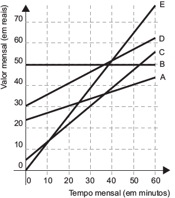

     No Brasil há várias operadoras e planos de telefonia celular.

     Uma pessoa recebeu 5 propostas (A, B, C, D e E) de planos telefônicos. O valor mensal de cada plano está em função do tempo mensal das chamadas, conforme o gráfico.

Essa pessoa pretende gastar exatamente R$ 30,00 por mês com telefone.

Dos planos telefônicos apresentados, qual é o mais vantajoso, em tempo de chamada, para o gasto previsto para essa pessoa?

- [ ] A
- [ ] B
- [x] C
- [ ] D
- [ ] E

Deve-se obter, dentre os gráficos que representam os planos A, B, C, D e E, o ponto de ordenada 30, que possui maior abscissa (maior tempo de conversação).

Observando a figura, tem-se que é o ponto do gráfico que representa o plano telefônico C.
