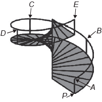
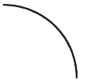
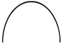
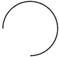
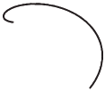
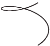
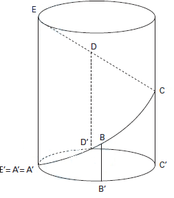
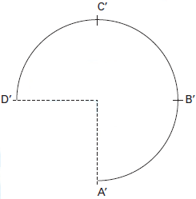

# q
     O acesso entre os dois andares de uma casa é feito através de uma escada circular (escada caracol), representada na figura. Os cinco pontos A, B, C, D, E sobre o corrimão estão igualmente espaçados, e os pontos P, A e E estão em uma mesma reta. Nessa escada, uma pessoa caminha deslizando a mão sobre o corrimão do ponto A até o ponto D.

A figura que melhor representa a projeção ortogonal, sobre o piso da casa (plano), do caminho percorrido pela mão dessa pessoa é:

# a

# b

# c

# d

# e

# r
c

# s
Considere a figura:

A escada circular pode ser representada pela diagonal do retângulo que forma a superfície lateral de um cilindro circular reto.

A projeção dessa diagonal sobre o plano da base é a circunferência da base do cilindro. Assim, a projeção ortogonal do caminho de A até D é dada pela figura:

