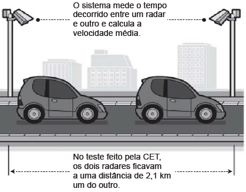
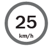
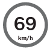
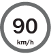
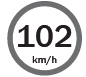
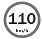

     A Companhia de Engenharia de Tráfego (CET) de São Paulo testou em 2013 novos radares que permitem o cálculo da velocidade média desenvolvida por um veículo em um trecho da via.

     As medições de velocidade deixariam de ocorrer de maneira instantânea, ao se passar pelo radar, e seriam feitas a partir da velocidade média no trecho, considerando o tempo gasto no percurso entre um radar e outro. Sabe-se que a velocidade média é calculada como sendo a razão entre a distância percorrida e o tempo gasto para percorrê-la.

     O teste realizado mostrou que o tempo que permite uma condução segura de deslocamento no percurso entre os dois radares deveria ser de, no mínimo, 1 minuto e 24 segundos. Com isso, a CET precisa instalar uma placa antes do primeiro radar informando a velocidade média máxima permitida nesse trecho da via. O valor a ser exibido na placa deve ser o maior possível, entre os que atendem às condições de condução segura observadas.

Disponível em: www1.folha.uol.com.br. Acesso em: 11 jan. 2014 (adaptado).

A placa de sinalização que informa a velocidade que atende a essas condições é

- [ ] 
- [ ] 
- [x] 
- [ ] 
- [ ] 

Segundo o texto, o trecho de 2,1 km pode ser percorrido em, no mínimo, 1 minuto e 24 segundos.

Convertendo esse tempo para horas, temos 1 min 24 segundos = 84 segundos.

1 hora ⎯ 3600 seg.\
       x ⎯ 84 seg.

 $x = \cfrac{84}{3600}$ horas.

A velocidade máxima permitida será:

$v = \cfrac{2,1\\,km}{\cfrac{84h}{3600}}$

$v = \cfrac{2,1 \cdot 3600}{84}$

$v = 90\\, km/h$

 

        