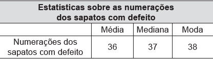

     Uma loja que vende sapatos recebeu diversas reclamações de seus clientes relacionadas à venda de sapatos de cor branca ou preta. Os donos da loja anotaram as numerações dos sapatos com defeito e fizeram um estudo estatístico com o intuito de reclamar com o fabricante.

     A tabela contém a média, a mediana e a moda desses dados anotados pelos donos.

     Para quantificar os sapatos pela cor, os donos representaram a cor branca pelo número 0 e a cor preta pelo número 1. Sabe-se que a média da distribuição desses zeros e uns é igual a 0,45.

     Os donos da loja decidiram que a numeração dos sapatos com maior número de reclamações e a cor com maior número de reclamações não serão mais vendidas.

A loja encaminhou um ofício ao fornecedor dos sapatos, explicando que não serão mais encomendados os sapatos de cor

- [x] branca e os de número 38.
- [ ] branca e os de número 37.
- [ ] branca e os de número 36.
- [ ] preta e os de número 38.
- [ ] preta e os de número 37.

Sendo x e y as quantidades de sapatos brancos e pretos, respectivamente, do enunciado tem-se:

$\cfrac{x\cdot0 + y \cdot 1}{x+y} = 0,45$

$y = 0,45 \cdot (x+y)$

$y = 0,45x + 0,45y$

$0,55y = 0,45x$

$y = \cfrac{0,45x}{0,55}$

Como $ \cfrac{0,45x}{0,55} < 1$, tem-se  $y\<x$ e, assim, existem mais sapatos defeituosos da cor branca (x), do que da cor preta (y).

Ainda, como a moda das numerações defeituosas é 38, a loja não deverá mais encomendar sapatos da cor branca e os de número 38.
