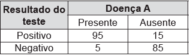

     Para analisar o desempenho de um método diagnóstico, realizam-se estudos em populações contendo pacientes sadios e doentes. Quatro situações distintas podem acontecer nesse contexto de teste:

1\) Paciente TEM a doença e o resultado do teste é POSITIVO.\
2\) Paciente TEM a doença e o resultado do teste é NEGATIVO.\
3\) Paciente NÃO TEM a doença e o resultado do teste é POSITIVO.\
4\) Paciente NÃO TEM a doença e o resultado do teste é NEGATIVO.

     Um índice de desempenho para avaliação de um teste diagnóstico é a sensibilidade, definida como a probabilidade de o resultado do teste ser POSITIVO se o paciente estiver com a doença.

     O quadro refere-se a um teste diagnóstico para a doença A, aplicado em uma amostra composta por duzentos indivíduos.

BENSEÑOR, I. M.; LOTUFO, P. A. Epidemiologia: abordagem prática. São Paulo: Sarvier, 2011 (adaptado).

Conforme o quadro do teste proposto, a sensibilidade dele é de

- [ ] 47,5%.
- [ ] 85,0%.
- [ ] 86,3%.
- [ ] 94,4%.
- [x] 95,0%.

O novo espaço amostral é formado por 95 + 5 = 100 pacientes que estão com a doença.

A probabilidade de o teste ser positivo nesse caso é de $\cfrac{95}{100} = 95\\%$..

A sensibilidade dele é de 95%.

        