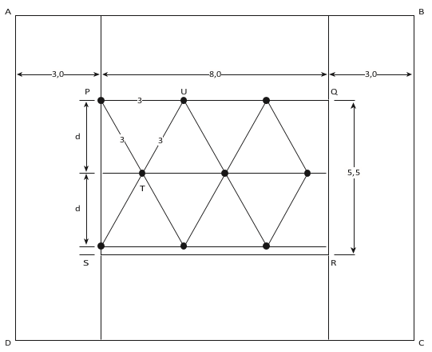

     Uma pessoa possui um espaço retangular de lados 11,5 m e 14 m no quintal de sua casa e pretende fazer um pomar doméstico de maçãs. Ao pesquisar sobre o plantio dessa fruta, descobriu que as mudas de maçã devem ser plantadas em covas com uma única muda e com espaçamento mínimo de 3 metros entre elas e as laterais do terreno. Ela sabe que conseguirá plantar um número maior de mudas em seu pomar se dispuser as covas em filas alinhadas paralelamente ao lado de maior extensão.

O número máximo de mudas que essa pessoa poderá plantar no espaço disponível é

- [ ] 4\.
- [ ] 8\.
- [x] 9\.
- [ ] 12\.
- [ ] 20\.

Na figura, ABCD é a representação do espaço retangular disponível para o plantio.

Ao descontarmos 3 m de cada lateral, a região útil para plantio é o retângulo PQRS.

Colocando as covas alinhadas paralelamente ao lado PQ e respeitando a distância mínima de 3 m entre as covas, a disposição que apresenta a menor distância entre 2 filas paralelas está representada a seguir

A distância d entre 2 filas paralelas é igual à altura do triângulo equilátero PTU de lado 3 m.

Logo, $d = \cfrac{l \sqrt{3}}{2}$ 

$d =\cfrac{3 \cdot 1,73 }{2}$

$d \approx 2,6 \\, m$

Dessa forma, como PS = 5,5 m e 2d $\approx$ 5,2 m, o número máximo de filas paralelas à PQ é 3.

Portanto, o número máximo de mudas que essa pessoa poderá plantar é $3 \times 3 = 9$
