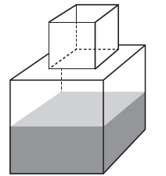
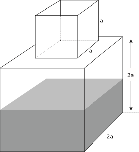

     Um fazendeiro tem um depósito para armazenar leite formado por duas partes cúbicas que se comunicam, como indicado na figura. A aresta da parte cúbica de baixo tem medida igual ao dobro da medida da aresta da parte cúbica de cima. A torneira utilizada para encher o depósito tem vazão constante e levou 8 minutos para encher metade da parte de baixo.

Quantos minutos essa torneira levará para encher completamente o restante do depósito?

- [ ] 8
- [x] 10
- [ ] 16
- [ ] 18
- [ ] 24

Temos :

\

Do enunciado e da figura, o volume do cubo de baixo é $(2a)^3 = 8a^3$, e o volume do cubo de cima é $a^3$.

Logo, o volume total é $8a^3 + a^3 = 9a^3$.

O volume preenchido da parte de baixo é $\cfrac{8a^3 }{2} = 4a^3$

Assim, o que resta a ser preenchido é $9a^3 - 4a^3 = 5a^3$.

Daí, tem-se :

8 minutos ----------------------- $4a^3$\
x minutos ----------------------- $5a^3$

$x \cdot 4a^3 = 8 \cdot 5a^3$

$x = \cfrac{40}{4} $ minutos.

$x = 10$ minutos

        