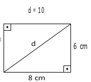

     Diariamente, uma residência consome 20160 Wh. Essa residência possui 100 células solares retangulares (dispositivos capazes de converter a luz solar em energia elétrica) de dimensões 6 cm x 8 cm. Cada uma das tais células produz, ao longo do dia, 24 Wh por centímetro de diagonal. O proprietário dessa residência quer produzir, por dia, exatamente a mesma quantidade de energia que sua casa consome.

Qual deve ser a ação desse proprietário para que ele atinja o seu objetivo?

- [x] Retirar 16 células.
- [ ] Retirar 40 células.
- [ ] Acrescentar 5 células.
- [ ] Acrescentar 20 células.
- [ ] Acrescentar 40 células.

Sabendo que o consumo é C = 20 160 Wh, tem-se :

$C = n \cdot d \cdot P$

n: nº de células\
d: diagonal da célula\
P: produção por centímetro de diagonal

\

20160 = $n \cdot 10 \cdot 24$

n = 84 células

Como a residência possui 100 células, devem-se retirar:\
100 - 84 = 16 células.
