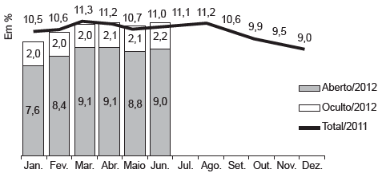

     O gráfico apresenta as taxas de desemprego durante o ano de 2011 e o primeiro semestre de 2012 na região metropolitana de São Paulo. A taxa de desemprego total é a soma das taxas de desemprego aberto e oculto.

     Suponha que a taxa de desemprego oculto do mês de dezembro de 2012 tenha sido a metade da mesma taxa em junho de 2012 e que a taxa de desemprego total em dezembro de 2012 seja igual a essa taxa em dezembro de 2011.

Disponível em: www.dieese.org.br. Acesso em: 1 ago. 2012 (fragmento).

Nesse caso, a taxa de desemprego aberto de dezembro de 2012 teria sido, em termos percentuais, de

- [ ] 1,1.
- [ ] 3,5.
- [ ] 4,5.
- [ ] 6,8.
- [x] 7,9.

Sendo x, y e z, respectivamente, as taxas de desemprego total, oculto e aberto em dezembro de 2012, tem- -se que:

x = 9,0

$y = \cfrac{2,2}{2} = 1,1$

z = 9 - 1,1 = 7,9

        