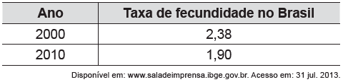

     A taxa de fecundidade é um indicador que expressa a condição, reprodutiva média das mulheres de uma região, e é importante para uma análise da dinâmica demográfica dessa região. A tabela apresenta os dados obtidos pelos Censos de 2000 e 2010, feitos pelo IBGE, com relação à taxa de fecundidade no Brasil.

     Suponha que a variação percentual relativa na taxa de fecundidade no período de 2000 a 2010 se repita no período de 2010 a 2020.

Nesse caso, em 2020 a taxa de fecundidade no Brasil estará mais próxima de

- [ ] 1,14.
- [ ] 1,42.
- [x] 1,52.
- [ ] 1,70.
- [ ] 1,80.

A variação percentual é dada por: $\cfrac{1,9 - 2,38}{2,38} \approx -20\\%$

Assim, em 2020, a taxa de fecundidade no Brasil estará mais próxima de: $1,90 - \cfrac{20}{100} \cdot 1,90 = 1,52$

        