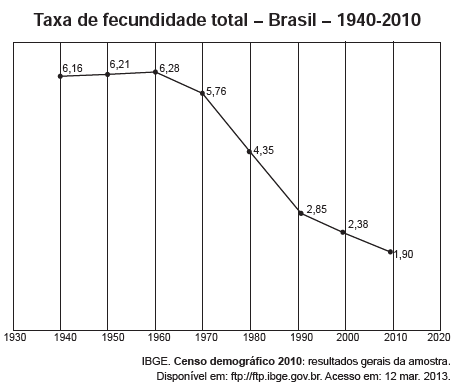

*O processo registrado no gráco gerou a seguinte consequência demográca:*

- [ ] *Decréscimo da população absoluta.*
- [x] *Redução do crescimento vegetativo.*
- [ ] *Diminuição da proporção de adultos.*
- [ ] *Expansão de políticas de controle da natalidade.*
- [ ] *Aumento da renovação da população economicamente ativa.*

O crescimento vegetativo, ou crescimento natural, é a diferença entre as taxas de natalidade e mortalidade. Uma das possibilidades de análise do comportamento da natalidade é por meio da observação da taxa de fecundidade, pois ela representa a média do número de filhos por mulher em idade fértil, que, segundo o IBGE, vai de 15 a 49 anos. O gráfico registra a redução da taxa de fecundidade no Brasil após a década de 1960, que traz, como consequência, a redução do crescimento vegetativo.
