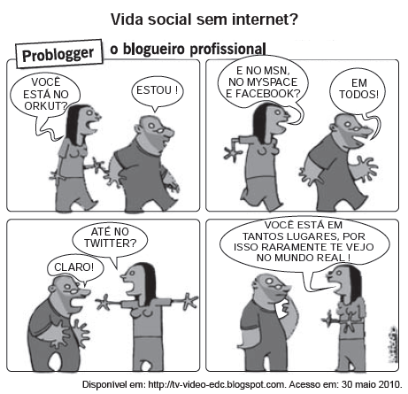

*A charge revela uma crítica aos meios de comunicação, em especial à internet, porque*

- [x] *questiona a integração das pessoas nas redes virtuais de relacionamento.*
- [ ] *considera as relações sociais como menos importantes que as virtuais.*
- [ ] *enaltece a pretensão do homem de estar em todos os lugares ao mesmo tempo.*
- [ ] *descreve com precisão as sociedades humanas no mundo globalizado.*
- [ ] *concebe a rede de computadores como o espaço mais ecaz para a construção de relações sociais.*

A utilização cada vez mais ampla das novas tecnologias de telecomunicações disponíveis tem sido objeto de estudos, haja vista o paradoxo gerado no plano da chamada globalização. Se, por um lado, as redes sociais criadas na internet viabilizam maior aproximação entre os indivíduos, por outro lado, as relações pessoais têm se caracterizado por distanciamentos acentuados e o isolamento das pessoas, fato frequentemente constatadona atualidade.
